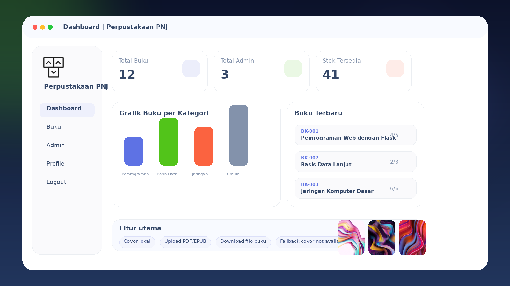
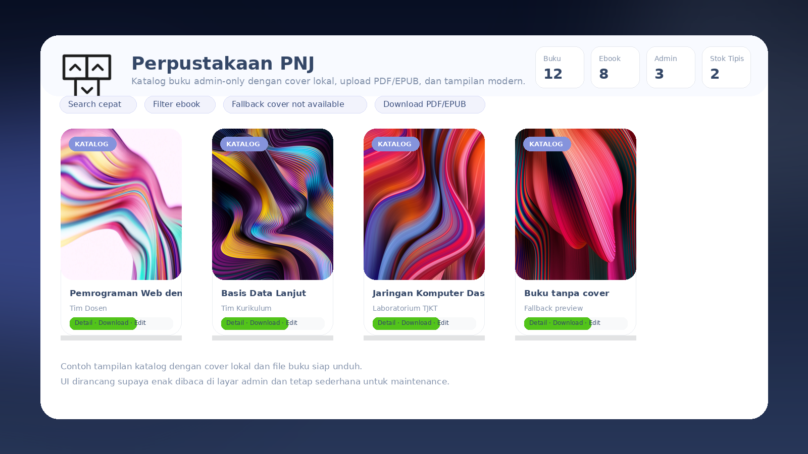
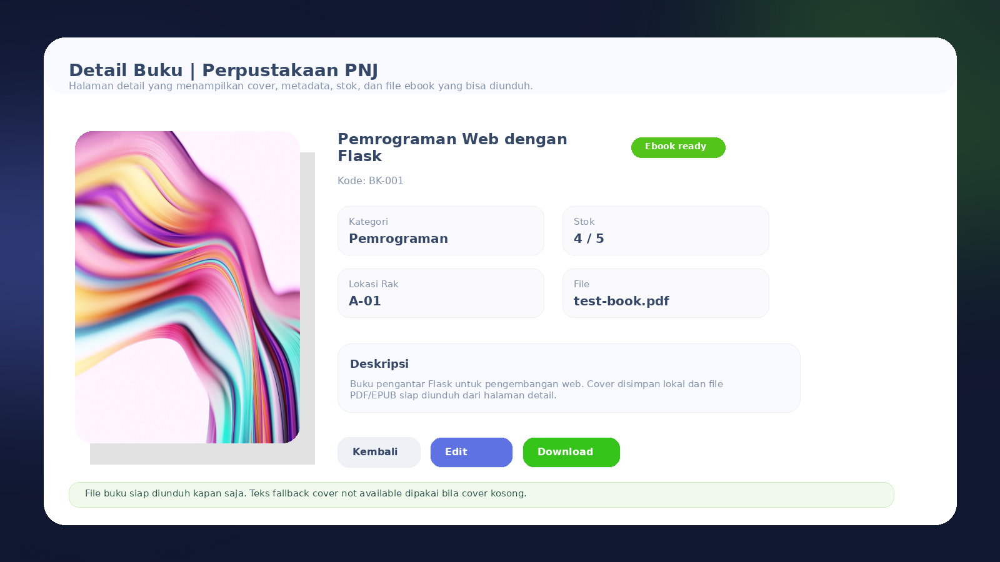

# Perpustakaan PNJ

<p align="center">
  
</p>

<p align="center"><em>Logo menggunakan file <code>assets/logo_perpustakaan_flask_web.png</code>.</em></p>

<p align="center">
  
  
  
  
</p>

Aplikasi web admin-only untuk mengelola koleksi buku Perpustakaan PNJ. Project ini dibuat agar mudah dipahami, mudah dijalankan, dan bisa dipasang di beberapa distribusi Linux dengan script Bash yang sama.

## Ringkasan project

Perpustakaan PNJ adalah web app berbasis Flask untuk:
- mengelola data buku secara terpusat
- menampilkan katalog buku dengan cover lokal
- upload dan download file buku PDF / EPUB
- mengelola akun admin
- menampilkan dashboard ringkas untuk monitoring data

Aplikasi dijalankan dengan Gunicorn di dalam Python virtual environment (`venv`).
Setelah install, Nginx akan diarahkan ke app Flask di port 80 sehingga akses lewat `http://IP_SERVER/` menampilkan Perpustakaan PNJ, bukan halaman default Nginx.

## Kenapa project ini dibuat

Project ini cocok untuk tugas dosen karena memperlihatkan alur deployment yang rapi:
- ada source code web app
- ada dependency Python yang terisolasi di `venv`
- ada service systemd untuk menjalankan aplikasi seperti server sungguhan
- ada Nginx sebagai reverse proxy
- ada script install dan uninstall yang jelas
- bisa dijalankan di beberapa distro Linux tanpa ubah banyak langkah

## Fitur utama

- Dashboard overview
- CRUD buku
- Manage admin / user admin
- Halaman profile admin
- Upload cover buku lokal
- Upload file buku PDF / EPUB
- Download file buku dari halaman detail
- Search dan filter katalog
- Fallback cover `cover not available` jika cover kosong
- Reverse proxy Nginx agar Flask tetap internal di port 8000

## Dukungan Linux

Script install sudah mendeteksi distro otomatis. Dukungan utama:
- Ubuntu / Debian
- Arch Linux / Manjaro
- Fedora / RHEL / CentOS
- openSUSE / SLES

## Struktur penting project

```txt
perpustakaan-flask-web/
├── apps/
├── assets/
│   └── readme/
├── nginx/
├── static/
├── uploads/
├── install.sh
├── uninstall.sh
├── requirements.txt
├── run.py
└── README.md
```

## Cara menjalankan yang paling mudah

### Opsi yang direkomendasikan: pakai install.sh

Kalau repo sudah di-clone:

```bash
git clone https://github.com/Alief1150/perpustakaan-flask-web.git
cd perpustakaan-flask-web
sudo bash install.sh
```

Kalau kamu hanya punya file `install.sh` dan menjalankannya di folder kosong, script akan clone repository ini otomatis lalu lanjut instalasi.

Yang dilakukan script:
- mendeteksi distro Linux
- memasang paket sistem yang dibutuhkan
- clone / update repo ke branch `main`
- membuat virtual environment
- install dependency Python
- membuat file `.env`
- memasang service systemd untuk Gunicorn
- memasang konfigurasi Nginx
- menyalakan service aplikasi

Setelah selesai, aplikasi bisa diakses lewat:
- lokal: `http://127.0.0.1:8000/`
- publik: `http://IP_SERVER/` melalui Nginx

## Contoh instalasi di beberapa distro Linux

### Ubuntu / Debian

```bash
sudo apt update
sudo apt install -y git python3 python3-venv python3-pip nginx

git clone https://github.com/Alief1150/perpustakaan-flask-web.git
cd perpustakaan-flask-web
sudo bash install.sh
```

### Arch Linux / Manjaro

```bash
sudo pacman -Syu --needed git python python-pip nginx

git clone https://github.com/Alief1150/perpustakaan-flask-web.git
cd perpustakaan-flask-web
sudo bash install.sh
```

### Fedora / RHEL / CentOS

```bash
sudo dnf install -y git python3 python3-pip python3-devel nginx

git clone https://github.com/Alief1150/perpustakaan-flask-web.git
cd perpustakaan-flask-web
sudo bash install.sh
```

### openSUSE / SLES

```bash
sudo zypper --non-interactive install git python3 python3-pip python3-devel nginx

git clone https://github.com/Alief1150/perpustakaan-flask-web.git
cd perpustakaan-flask-web
sudo bash install.sh
```

Catatan:
- langkah manual di atas menunjukkan perbedaan paket antar distro
- sebenarnya `install.sh` sudah menangani instalasi paket sistem secara otomatis
- kalau paket sistem sudah ada, script akan lanjut ke tahap setup project

## Menjalankan manual untuk development

Kalau ingin menjalankan tanpa service production:

```bash
python3 -m venv .venv
source .venv/bin/activate
pip install -r requirements.txt
python run.py
```

Akses:

```txt
http://127.0.0.1:8000/
```

## Cara akses lewat Nginx

Secara arsitektur:
- Flask / Gunicorn jalan di `127.0.0.1:8000`
- Nginx menjadi pintu publik di port `80`

Jadi alurnya seperti ini:

```txt
Browser -> Nginx (80) -> Gunicorn (127.0.0.1:8000) -> Flask app
```

Ini adalah pola yang umum dipakai untuk deployment web app Python di Linux server.

## Cara uninstall

Untuk menghapus komponen project yang dipasang oleh script:

```bash
sudo bash uninstall.sh
```

Yang dihapus oleh uninstall:
- service systemd
- konfigurasi Nginx project
- `.env`
- folder virtual environment `.venv`
- folder project
- state instalasi milik project

Uninstall tidak menghapus dependency global sistem, jadi lebih aman.

## File penting

- `run.py` → entrypoint aplikasi
- `gunicorn-cfg.py` → konfigurasi Gunicorn
- `env.sample` → contoh environment variable
- `install.sh` → installer otomatis multi-distro
- `uninstall.sh` → penghapus komponen project
- `nginx/perpustakaan.conf` → contoh konfigurasi reverse proxy

## Catatan database

Project ini memakai SQLite secara default, jadi tidak perlu install database server terpisah.
Data disimpan di file database lokal pada project.

## Screenshot

<p align="center">
  
  
  
</p>

## Ringkasan singkat untuk dosen

Project ini menunjukkan deployment Flask yang rapi dan realistis:
- source code jelas
- dependency Python terisolasi di venv
- aplikasi dijalankan oleh Gunicorn
- akses publik lewat Nginx
- bisa dipasang di beberapa distro Linux
- ada script install dan uninstall yang seimbang

Kalau ingin, saya juga bisa bantu menambahkan bagian presentasi singkat di README: tujuan project, alur kerja, dan pembagian folder agar lebih enak dijelaskan saat demo.
